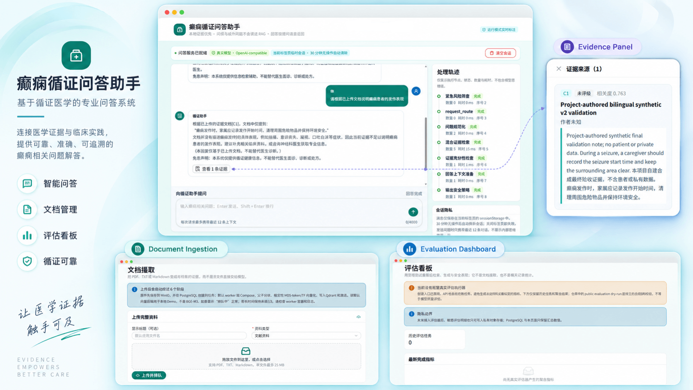
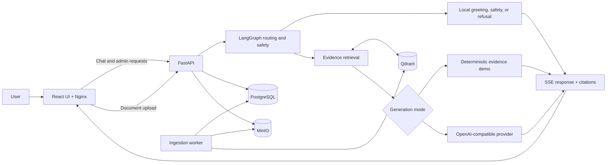

# Epilepsy QA System

An evidence-aware RAG web application for exploring epilepsy literature and local knowledge through traceable answers and citations.

**Built with React, TypeScript, FastAPI, LangGraph, PostgreSQL, MinIO, Qdrant, and Docker Compose.**

[Quick Start](#quick-start) · [Demo Guide](docs/DEMO.md) · [Architecture](docs/ARCHITECTURE.md) · [Runbook](docs/RUNBOOK.md) · [中文新手指南](BEGINNER_RUN_GUIDE.md)



*System overview covering chat, evidence inspection, document ingestion, and evaluation. This image presents the UI; model and clinical quality remain subject to the evaluation boundaries described below.*

## Overview

Epilepsy QA System brings document ingestion, retrieval, safety-aware routing, and streamed answers into one local web application. Users can upload non-sensitive epilepsy-related material, ask questions in Chinese or English, and inspect the evidence behind each supported answer.

The managed ingestion pipeline stores source files in MinIO, tracks documents and jobs in PostgreSQL, and indexes active evidence in Qdrant. The chat service retrieves relevant passages, applies evidence and safety checks, and responds through either the built-in deterministic evidence demo or an explicitly configured OpenAI-compatible model provider.

The default Docker Compose setup runs locally without an API key or model download, making it suitable for exploring the complete software workflow before enabling optional model-backed generation.

## Key Features

- **Evidence-aware question answering** — answers include citations and an evidence panel for source inspection.
- **Managed document ingestion** — upload PDF, TXT, or Markdown files from the admin UI and follow processing progress.
- **Background indexing workflow** — a dedicated worker parses, chunks, embeds, and activates searchable evidence.
- **Streaming web experience** — React UI with SSE responses, processing traces, cancellation, retry, and session controls.
- **Chinese and English interaction** — system responses follow the language of the latest user message.
- **Safety-aware routing** — greetings, obvious out-of-scope requests, emergency language, and insufficient evidence are handled explicitly.
- **Flexible generation layer** — use the deterministic local demo or connect an OpenAI-compatible provider such as DeepSeek or a self-hosted endpoint.
- **Admin and evaluation surfaces** — manage the knowledge base and review aggregate evaluation history; new evaluation runs remain disabled until a controlled evaluator is configured.

## How It Works



PostgreSQL is the source of truth for document and job state, MinIO stores original uploads, and Qdrant serves activated evidence chunks. See [Architecture](docs/ARCHITECTURE.md) for the chat graph, ingestion lifecycle, and consistency model.

## Quick Start

### Prerequisites

- Docker Engine or Docker Desktop
- Docker Compose v2
- Git
- On Windows: Docker Desktop integration with your WSL distribution

Run the following commands in a Linux or WSL shell.

### 1. Clone the repository

```bash
git clone https://github.com/BrianFang18/epilepsy_qa_system.git
cd epilepsy_qa_system
```

### 2. Start the application

```bash
export COMPOSE_DISABLE_ENV_FILE=1

docker compose --env-file config/compose.env.example config --quiet
docker compose --env-file config/compose.env.example up --build -d
```

The setup steps take only a few minutes; initial image downloads and the first build may take longer depending on network speed and available resources. Check readiness with:

```bash
docker compose --env-file config/compose.env.example ps --all
curl -fsS http://127.0.0.1:8080/healthz
curl -fsS http://127.0.0.1:8010/health/ready
```

Continue when the core services are healthy, the worker is running, and the one-shot `migrate` service shows `Exited (0)`.

> The checked-in configuration starts the deterministic local demo. It exercises the real UI, API, storage, queue, worker, and retrieval pipeline, but does not call an LLM or use BGE-M3.

### 3. Open the UI

| Entry point | URL |
| --- | --- |
| Chat | <http://127.0.0.1:8080/> |
| Admin login | <http://127.0.0.1:8080/admin/login> |
| API documentation | <http://127.0.0.1:8010/docs> |

### 4. Stop the application

```bash
docker compose --env-file config/compose.env.example down
```

This stops the stack while preserving the PostgreSQL, MinIO, and Qdrant volumes.

## Try the Demo

The example configuration includes a loopback-only administrator account:

```text
Username: CHANGE_ME_admin
Password: CHANGE_ME_admin_password
```

1. Open the [admin login](http://127.0.0.1:8080/admin/login) and sign in.
2. Go to **Document ingestion** and upload a non-sensitive PDF, TXT, or Markdown file up to 25 MB.
3. Wait for the job to reach **succeeded / 100%**; the default worker starts automatically.
4. Return to the [chat UI](http://127.0.0.1:8080/) and ask a question using language and terms found in the document.
5. Open the evidence panel to inspect the cited excerpts and processing trace.

The example credentials are public placeholders for a local demo. Replace them before using the application in any shared environment. For a guided walkthrough and troubleshooting, see the [Beginner Guide](BEGINNER_RUN_GUIDE.md) or [Demo Guide](docs/DEMO.md).

## Runtime Options

| Option | Purpose |
| --- | --- |
| **Deterministic demo (default)** | Reproducible local retrieval with `deterministic-md5-tf-v2` and evidence excerpts; no API key or model weights required. |
| **OpenAI-compatible generation** | Set `CHAT_LLM_MODE=openai_compatible` and provide a private endpoint, API key, and model ID through a Git-ignored local configuration. This changes answer generation, not embeddings. |
| **BGE-M3 ingestion** | Advanced opt-in worker profile requiring local model artifacts and matching query-side configuration; it is not part of the standard Quick Start. |

Runtime configuration is explicit: the repository does not automatically select a paid provider, download model weights, or expose a local model server. Enabling an OpenAI-compatible provider sends the latest question, request-scoped chat history, and retrieved evidence to that configured endpoint, so use only a trusted provider and non-sensitive data. Follow the [Runbook](docs/RUNBOOK.md) before enabling advanced modes.

## Repository Structure

```text
app/                 FastAPI, chat routing, retrieval, admin, and worker code
frontend/            React/TypeScript application and Nginx runtime
alembic/             PostgreSQL database migrations
config/              Explicit local Compose configuration and corpus policy
docs/                Architecture, operations, demo, and project guides
public_eval/          Project-authored synthetic smoke-evaluation contract
tests/                Backend unit and opt-in integration tests
docker-compose.yml   Local application topology
pyproject.toml        Python dependencies and development tooling
```

## Documentation

| Document | What you will find |
| --- | --- |
| [中文新手使用指南](BEGINNER_RUN_GUIDE.md) | Step-by-step startup, ingestion, chat, and troubleshooting |
| [Demo Guide](docs/DEMO.md) | Repeatable end-to-end demonstration flow |
| [Architecture](docs/ARCHITECTURE.md) | Components, routing, ingestion, storage, and consistency design |
| [Runbook](docs/RUNBOOK.md) | Operations, logs, recovery, provider setup, and advanced runtime notes |
| [Public Evaluation](public_eval/README.md) | Synthetic smoke dataset contract and runner boundaries |
| [Contributing](CONTRIBUTING.md) | Development workflow, quality checks, and data rules |
| [Security](SECURITY.md) | Vulnerability reporting and security guidance |

## Project Status and Evaluation

The repository defines automated backend, frontend, public-evaluation, and Compose checks in CI. The default stack is designed to demonstrate the integrated application workflow with reproducible local behavior.

The evaluation dashboard currently exposes the product surface and historical aggregate view, while creation of new runs is disabled until a controlled dataset, reference evidence, metric implementation, and evaluation runner are configured. The checked-in `public_eval` package is a small synthetic smoke suite for contracts and deterministic safety behavior—not a measurement of model quality or clinical effectiveness.

Real-provider output quality, advanced BGE-M3 retrieval, and clinical performance require separate, versioned evaluation with appropriately licensed data and expert review.

## Contributing

Issues, bug reports, suggestions, and pull requests are welcome. Start with [CONTRIBUTING.md](CONTRIBUTING.md) for the development workflow and repository rules. Please do not include patient-identifiable data, private records, credentials, unlicensed documents, private evaluation answers, or model weights in contributions.

Report security issues through the process described in [SECURITY.md](SECURITY.md), not through a public issue.

## Medical Disclaimer

This project is intended for research, education, engineering demonstration, and information retrieval. It is **not a medical device** and is not a substitute for professional diagnosis, treatment, medication adjustment, or emergency care.

Do not upload patient-identifiable or sensitive clinical information. For an active or prolonged seizure, breathing difficulty, injury, or immediate danger, contact local emergency services and qualified medical professionals.

## License

Released under the [MIT License](LICENSE). Third-party software, content, models, data, and external services remain subject to their own terms; see [THIRD_PARTY_NOTICES.md](THIRD_PARTY_NOTICES.md).
